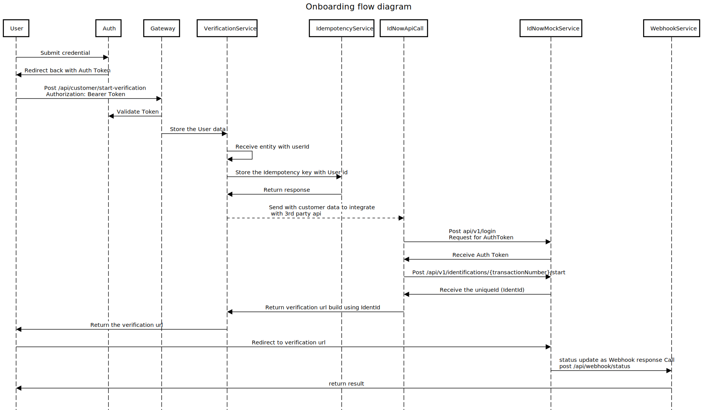

# Statement of Technical Exercise

## Context 
Our platform provides digital onboarding for financial services. As part of the onboarding process, we must verify a user's identity using a 
third-party identity verification provider. We plan to integrate with **IDnow AutoIdent**, a digital identity verification solution that 
allows users to verify their identity by scanning an ID document and performing a liveness check. 
Documentation: https://docs-autoident.idnow.io/ (signing features are out of scope of this assignment) 
The service exposes **REST APIs** and provides a **verification flow hosted by IDnow**. 

# Scenario 
You are designing a **Java backend service** that supports a user onboarding process. During onboarding, users must complete an **identity verification** 
using IDnow. The process should work as follows: 
1.  The frontend requests the creation of an identity verification session. 
2.  The backend calls IDnow to create a verification session. 
3.  The backend returns the **verification URL** to the frontend. 
4.  The user completes identity verification on IDnow. 
5.  The backend receives the **verification result** from IDnow. 
6.  The verification result is stored and exposed to other internal services.

# Project Overview
- This project implements a customer onboarding system to onboard customer and along with identity verification.During onboarding, users must complete an **identity verification** 
  using IDnow.
- This system handles different identification Type (AutoIdent, VideoIdent(Not implemented) etc)
- It applies
   - Perform real time customer identity using IdNow 3rd party api service
- It exposes REST APIs for
   - customer verification
   - calling 3rd party API using Rest end point
   - Handle response as Webhook
   - IDmock service

# features
 - Customer onboarding process with identification type (AutoIdent, VideoIdent etc.)
 - Perform real time customer identity using IdNow 3rd party api service
 - Implement Idnow mock service to integrate the API and for testing
 - Implement the response from IDNow using webhook
 - Prevent the processing of duplicate request by implementing Idempotency Key
 - add Swagger to list down all the Rest end points.
 - Code is in working condition and need to start IDNowMock Service and Onboading process service.

# Tech Stack
 - Language: Java 21
 - Framework: Spring Boot 4
 - Build Tool: Maven
 - Database: MySQL

# Real time identity verification
  - Integrate 3rd party IDNow with customer data based on Identification type
     - receive the identificaion id
     - redirect to verification URL with identid
     - return the status using webhook

# Assumption
 - IDNowMock spring boot application build to return the mock result as don't have IDNow api access.

# System Architecture
  

  
System Architecture

  
 
 ## Services

  - User-Service
      Handle the user signin and signup using JWT Authentication
      Routes:
      - /auth/** -> signin and signup user
      - Spring Security for JWT Authentication (Validate all incoming requests)
        
  - verification-Service
      - Expose 'POST /api/customer/' -- start user verificaton process
      - Integrate with 3rd party Api and manage the verification URL
  - IdentityVerificationAPIIntegration - Service
      - Integrate the 3rd Party IDNow API (in my case it is IDNowMock service I created)
      - get the result from API
     Routes:
      - POST /api/v1/login - to get the auth token from IDNow api
      - POST /api/v1/identifications/<<txnNumber>>/start - Start the identification process to IDNow
   - Idempotency-Service
       -  Store the idempotecy key with user id in database to prevent duplicate processing of request   

  

 # Flow Diagram

Flow Diagram

 

# Contributor
📧 [Ankit Goyal(mailto:ankit.goyal@capco.com)

# Run Book
1. Clone the repository: 
    - SSH:   `git clone git@github.com/Ankit-matrix106/technical-assignment.git`
    - Https: `git clone https://github.com/Ankit-matrix106/technical-assignment.git`
2. Move inside the local repository: `cd onboarding`
3. Move inside the local repository: `cd idnowmock`
4. Build the project: `mvn clean install`
5. Run the application: 
   - `mvn -pl idnowmock spring-boot:run`
   - `mvn -pl onboarding spring-boot:run -Dspring.profiles.active=dev`
5. Access the application at 
   - idnowmock -> `http://localhost:8085`
   - onboarding -> `http://localhost:8082` (As I choose the dev profile in application_dev.properties)

# Note
   Both services 'Idnowmock and onboarding' is up and running mode. I have used MYSQL as a database to store the user data.
